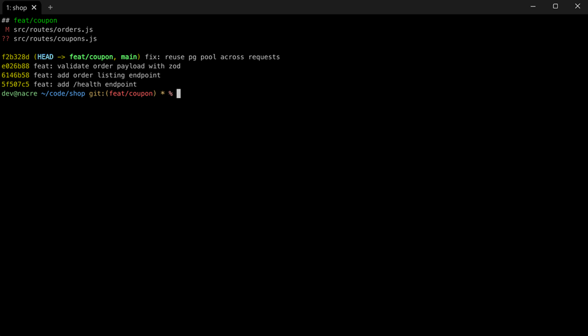
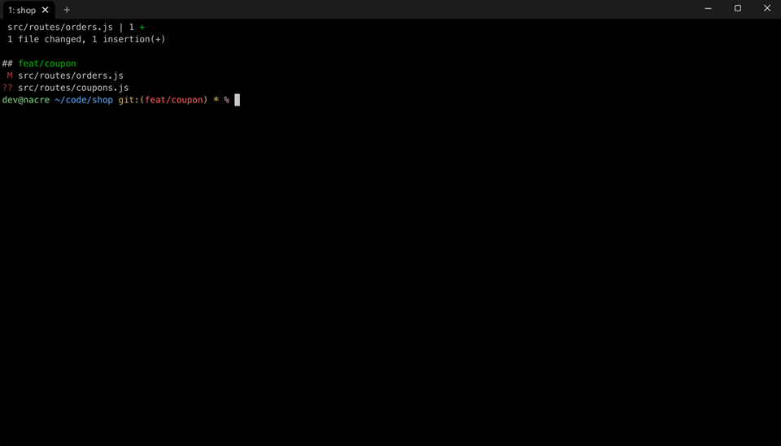
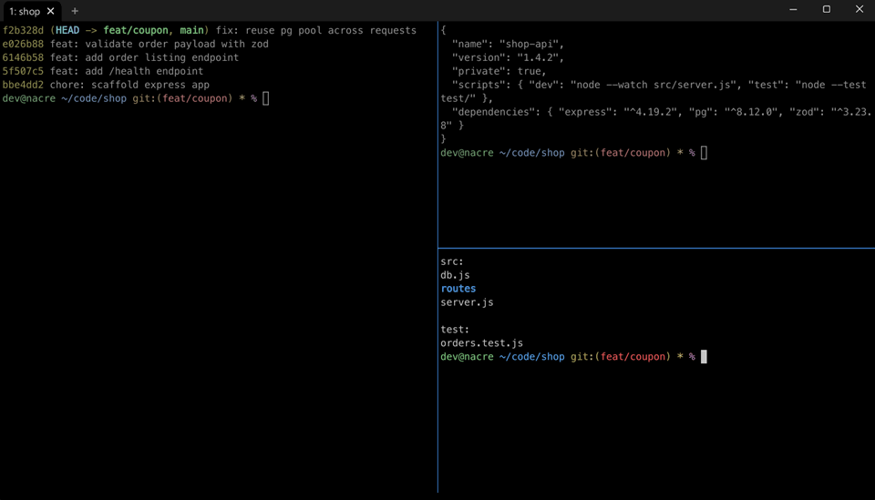
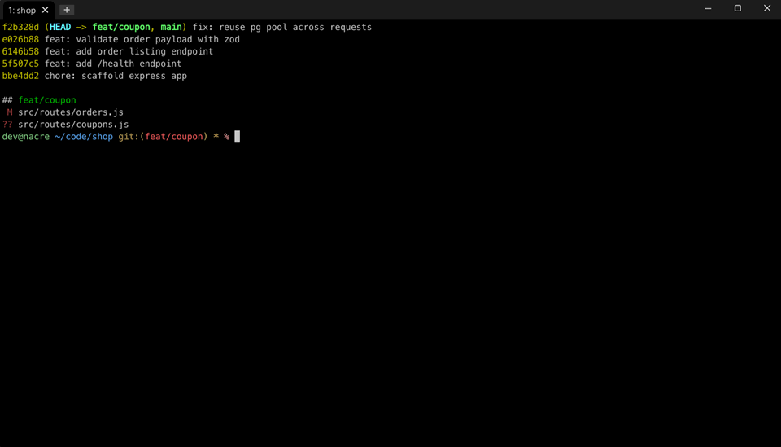
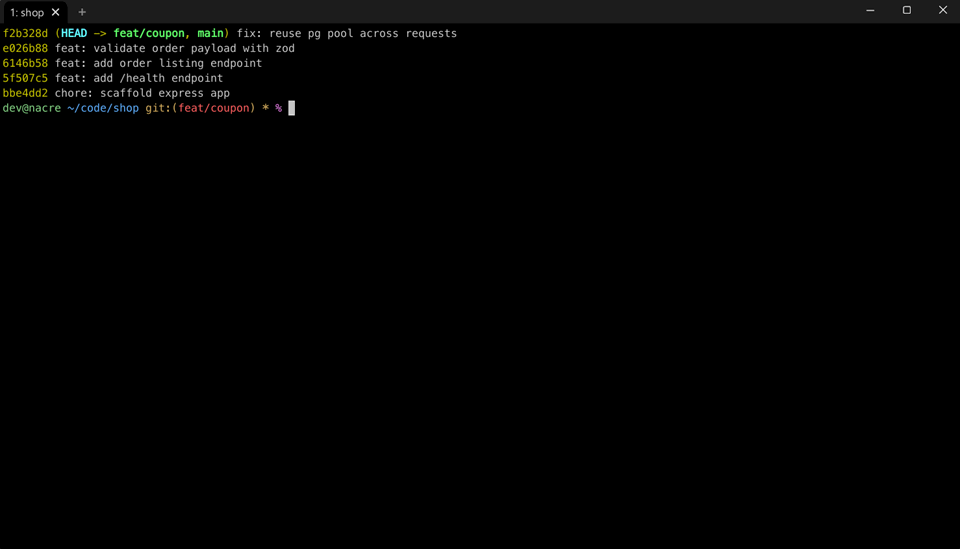
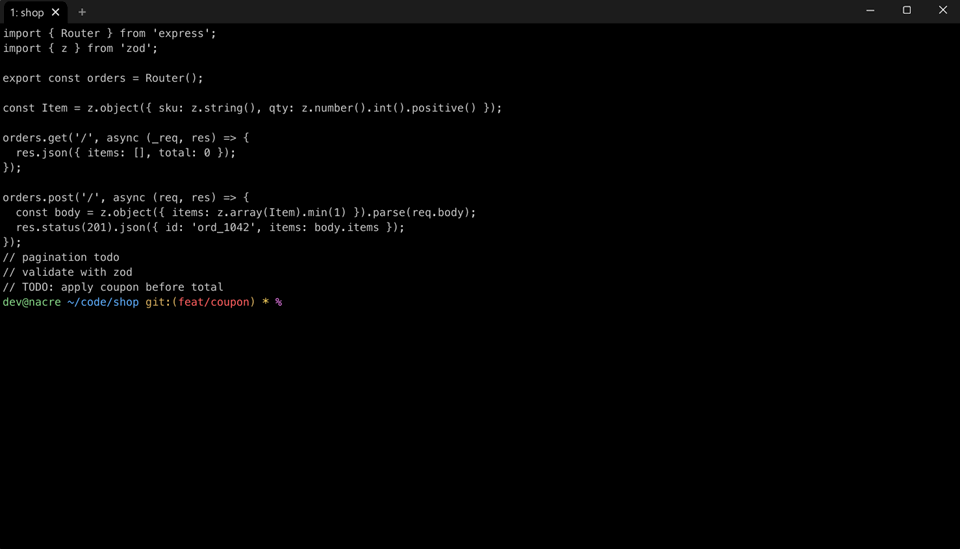
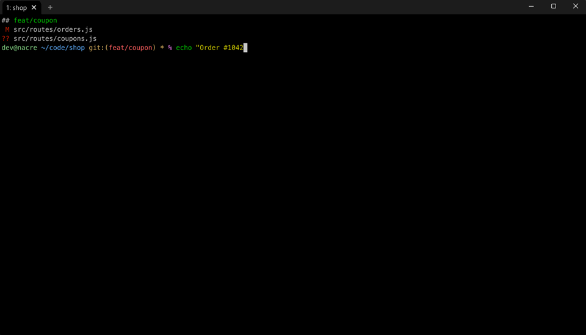
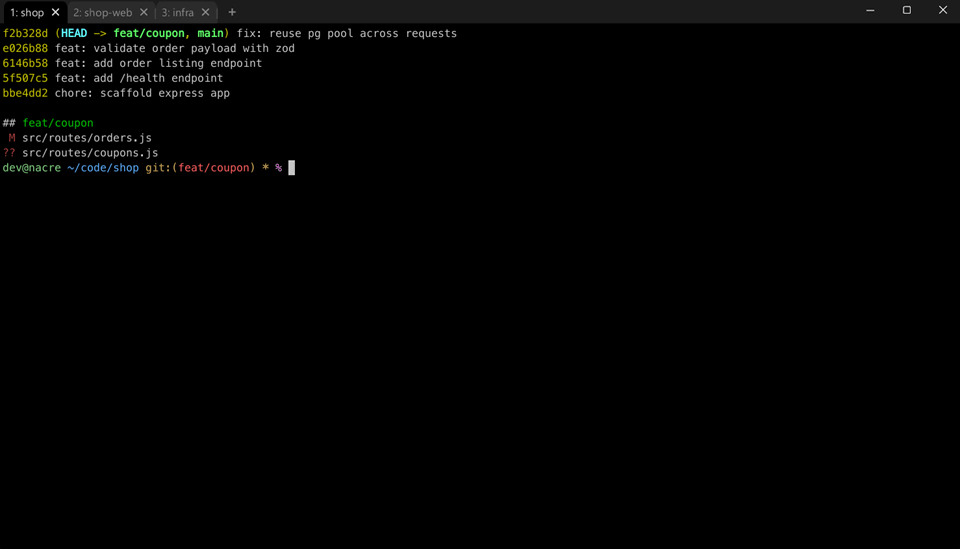
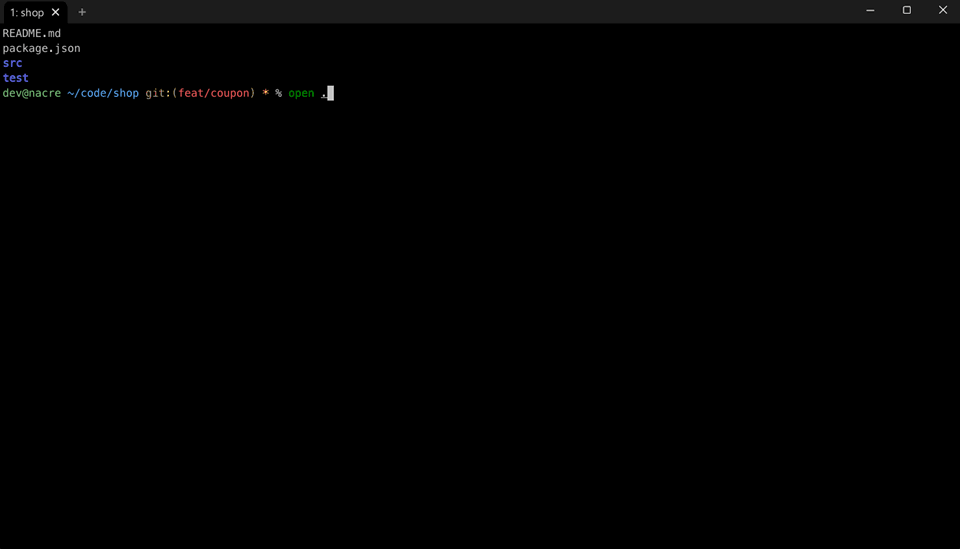

# Nacre

Windows 11에서 macOS iTerm 같은 터미널 환경을 구성합니다.

## 설치

PowerShell에서 실행합니다.

```powershell
irm https://nhahan.github.io/nacre/install.ps1 | iex
```

## 기능

- **화면 좌우 분할**: `Ctrl+Shift+V`

  

- **화면 상하 분할**: `Ctrl+Shift+H`

  

- **분할 화면 이동**: `Ctrl+Shift+방향키`

  

- **새 창·분할·닫기 메뉴**: 탭바 `+` 버튼 우클릭

  

- **복사 / 붙여넣기**: `Ctrl+C` / `Ctrl+V`

  

- **글자 크기 조절**: `Ctrl+마우스 휠`

  

- **줄바꿈**: `Shift+Enter`

  

- **탭 이동**: `Alt+1~9`

  

- **폴더·파일·URL을 Windows에서 열기**: `open` 명령

  
